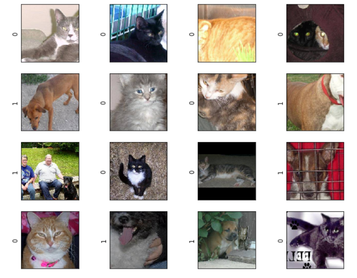
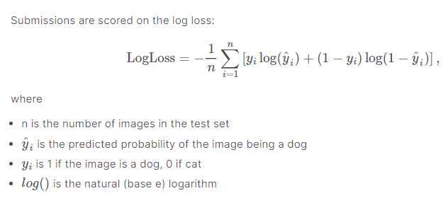

# An example of image recognition(kaggle competition:dogs vs cats)

## Pytorch implementation

## Preprocess

* 每张图片压缩到[0,1]（toTensor）
* 减去mean=[0.485, 0.456, 0.406]，再除以std = [0.229, 0.224, 0.225]（归一化），这是ImageNet上常用的，如果Pretrain为False，可使用[0.5,0.5,0.5]

## Data

* download: https://www.kaggle.com/c/dogs-vs-cats/data?select=train.zip

## Result

|              | epochs | running time(GPU:2080Ti) | pretrain |  accruay（train: 25000，test: 12500）   |
| :----------: | :----: | :----------------------: | :------: | :-------------------------------------: |
|    VGG16     |   20   |         1:17:57          |   True   | train: 98.98% ；test(logloss): 0.12360  |
|    VGG19     |   20   |         1:26:05          |   True   | train: 98.84% ；test(logloss): 0.11135  |
|  GoogleNet   |   20   |         3:14:35          |   True   | train: 98.68% ；test(logloss): 0.12219  |
|  ResNet152   |   20   |         3:56:54          |   True   | train: 99.89% ；test(logloss): 0.09463  |
| Inception-v3 |   20   |         2:34:41          |   True   | train: 99.92% ；test(logloss): 0.08733  |

* 训练评价指标使用LogLoss

